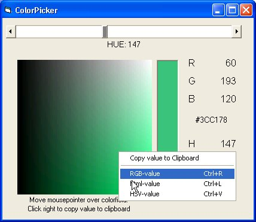



## Color\-picker\_2

### Description

This program lets you find a color with the HSV-values. The RGB-values are also calculated. You can copy these colorvalues to the clipboard for use in a webpage or other application.
 
### More Info
 

             |
---                |---
**Submitted On**   |2002-04-01 22:07:08
**By**             |[christine daniels](https://github.com/Planet-Source-Code/PSCIndex/blob/master/ByAuthor/christine-daniels.md)
**Level**          |Intermediate
**User Rating**    |5.0 (10 globes from 2 users)
**Compatibility**  |VB 6\.0
**Category**       |[Graphics](https://github.com/Planet-Source-Code/PSCIndex/blob/master/ByCategory/graphics__1-46.md)
**World**          |[Visual Basic](https://github.com/Planet-Source-Code/PSCIndex/blob/master/ByWorld/visual-basic.md)
**Archive File**   |[Color\-pick1053717122002\.zip](https://github.com/Planet-Source-Code/christine-daniels-color-picker-2__1-36837/archive/master.zip)

